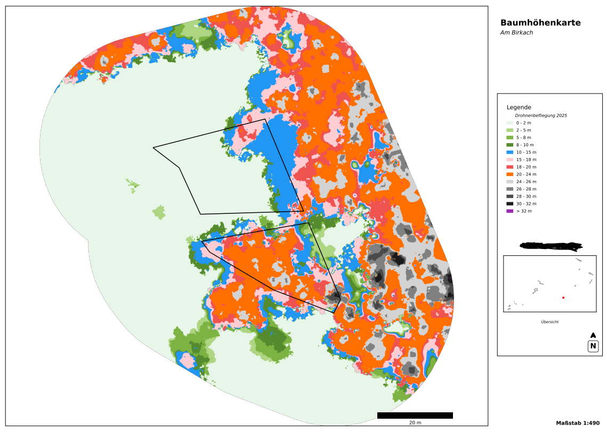

# CHM Mapper - Automated Canopy Height Model Cartographic Mapping

A fully automated Python workflow to create high-quality cartographic PDF maps from Canopy Height Model (CHM) rasters with vector overlays for forestry applications.

## Features

-  **Automated Map Generation**: Create publication-ready PDF maps from CHM rasters
-  **Vector Integration**: Overlay forest compartments/inventory areas as boundaries
-  **Custom Classification**: Flexible height class definitions with custom color schemes
-  **Cartographic Elements**: Automatic title, legend, scale bar, and north arrow
-  **Batch Processing**: Process multiple areas automatically
-  **High-Quality Output**: 300 DPI PDF export for printing and reports
-  **Forestry-Ready**: Pre-configured for forestry applications

## Example Output



*Example cartographic map showing tree heights classified into discrete height classes with legend, scale bar, and north arrow.*

## Installation

### 1. Clone or Download

```bash
cd 20_tree_height_mapper
```

### 2. Create Virtual Environment (Recommended)

```bash
# Windows
python -m venv venv
venv\Scripts\activate

# Linux/Mac
python -m venv venv
source venv/bin/activate
```

### 3. Install Dependencies

```bash
pip install -r requirements.txt
```

## Required Libraries

- **rasterio** - Raster data I/O
- **geopandas** - Vector data handling
- **matplotlib** - Plotting and map creation
- **matplotlib-scalebar** - Automatic scale bars
- **numpy** - Numerical operations
- **shapely** - Geometric operations

## Quick Start

### Option 1: Using the Jupyter Notebook (Recommended for Testing)

1. Open `chm_mapping_tutorial.ipynb` in Jupyter or VS Code
2. Update the data paths in the second cell
3. Run through the examples step by step

```bash
jupyter notebook chm_mapping_tutorial.ipynb
```

### Option 2: Using the Configuration File

1. Edit `modules/config.py` with your data paths and preferences:

```python
CHM_RASTER_PATH = "data/chm_raster.tif"
VECTOR_SHAPEFILE_PATH = "data/forest_compartments.gpkg"
OUTPUT_DIRECTORY = "output"
```

2. Run the main script:

```bash
python run.py
```

### Option 3: Using Python Code Directly

```python
from modules.chm_mapper import create_chm_map

create_chm_map(
    chm_path="data/chm_raster.tif",
    vector_path="data/forest_compartments.shp",
    output_path="output/my_map.pdf",
    title="Baumhöhenkarte",
    subtitle="Am Birkach",
    clip_to_area=True
)
```

## Usage Examples

### Example 1: Simple Map

```python
from chm_mapper import create_chm_map

create_chm_map(
    chm_path="data/chm.tif",
    output_path="output/simple_map.pdf",
    title="Baumhöhenkarte",
    clip_to_area=False
)
```

### Example 2: Map with Vector Overlay

```python
create_chm_map(
    chm_path="data/chm.tif",
    vector_path="data/boundaries.shp",
    output_path="output/map_with_boundaries.pdf",
    title="Baumhöhenkarte",
    subtitle="Am Birkach",
    clip_to_area=True
)
```

### Example 3: Custom Height Classes

```python
# Define forestry development stages
forestry_classes = [
    (0, 5, '0-5 m (Jungwuchs)'),
    (5, 15, '5-15 m (Dickung)'),
    (15, 25, '15-25 m (Stangenholz)'),
    (25, 35, '25-35 m (Baumholz)'),
    (35, 1000, '>35 m (Altholz)')
]

create_chm_map(
    chm_path="data/chm.tif",
    vector_path="data/boundaries.shp",
    output_path="output/forestry_stages.pdf",
    title="Waldentwicklungsstufen",
    height_classes=forestry_classes
)
```

### Example 4: Batch Processing

```python
from modules.chm_mapper import CHMMapper

mapper = CHMMapper("data/chm.tif", "data/compartments.shp")
mapper.load_data()

# Process all areas automatically
mapper.process_all_areas(
    output_dir="output/batch_maps",
    title_field="Name"  # Use 'Name' field from shapefile
)
```

## Project Structure

```
chm_mapper/
├── run.py                     # Entry point script
├── modules/                   # Main Python package
│   ├── __init__.py            # Package initialization
│   ├── chm_mapper.py          # Core mapping functionality
│   ├── config.py              # Configuration file
│   └── run_mapper.py          # CLI workflow script
├── chm_mapping_tutorial.ipynb # Interactive tutorial notebook
├── chm_batch_mapping.ipynb    # Batch processing notebook
├── requirements.txt           # Python dependencies
├── README.md                  # This file
├── .gitignore                 # Git ignore rules
├── data/                      # Your input data (not tracked)
│   ├── chm_raster.tif
│   └── forest_compartments.gpkg
└── output/                    # Generated maps (not tracked)
    └── *.pdf
```

## Input Data Requirements

### CHM Raster
- Format: GeoTIFF (.tif)
- CRS: Projected coordinate system (meters)
- Values: Tree heights in meters
- NoData: Properly defined (automatically handled)

### Vector Boundaries (Optional)
- Format: **GeoPackage (.gpkg)** - Recommended! or Shapefile (.shp), KML (.kml), GeoJSON (.geojson)
- CRS: Any (automatically reprojected to match CHM)
- Geometry: Polygon or MultiPolygon
- Attributes: Optional (can be used for map titles)

**Why GeoPackage?**
- ✅ Single file (no .shp, .shx, .dbf, .prj mess)
- ✅ Faster performance
- ✅ No 2GB size limit
- ✅ Better attribute support
- ✅ Modern open standard

**Supported Formats:**
- `.gpkg` - GeoPackage (recommended)
- `.shp` - Shapefile (includes .shx, .dbf, .prj files)
- `.kml` - Keyhole Markup Language (Google Earth format)
- `.geojson` - GeoJSON

## Customization

### Height Classes

Default classes (in meters):
- 0-2 m, 2-5 m, 5-10 m, 10-15 m, 15-20 m, 20-25 m, 25-30 m, 30-35 m, >35 m

Edit in `config.py`:
```python
HEIGHT_CLASSES = [
    (0, 2, '0-2 m'),
    (2, 5, '2-5 m'),
    # ... add more classes
]
```

### Color Scheme

Default: Yellow-green to dark green gradient

Edit in `config.py`:
```python
CUSTOM_COLORS = [
    '#FFF7BC',  # Light yellow
    '#A6D96A',  # Light green
    '#1A9850',  # Dark green
    # ... one color per height class
]
```

### Map Layout

Edit in `config.py`:
```python
OUTPUT_DPI = 300              # Resolution
FIGURE_SIZE = (11.69, 16.53)  # A3 portrait
LEGEND_NCOLS = 3              # Legend columns
```

## Output

- **Format**: PDF (vector graphics, scalable)
- **Resolution**: 300 DPI (default, configurable)
- **Size**: A3 portrait (default, configurable)
- **Elements**:
  - Title and subtitle
  - Classified CHM raster with custom colors
  - Vector boundaries (if provided)
  - Discrete legend with height classes
  - Metric scale bar (CRS-aware)
  - North arrow
  - Clean map frame

## Troubleshooting

### Common Issues

**Import Error: No module named 'rasterio'**
```bash
pip install -r requirements.txt
```

**CRS Mismatch Warning**
- The tool automatically reprojects vector data to match CHM CRS

**Empty Map / All White**
- Check that CHM values are reasonable (0-50 m typical)
- Verify NoData values are properly set
- Ensure vector and raster overlap spatially

**Memory Error with Large Rasters**
- Process smaller areas using vector clipping
- Reduce output DPI in config

## Advanced Usage

### Using the CHMMapper Class

```python
from chm_mapper import CHMMapper

# Initialize
mapper = CHMMapper("data/chm.tif", "data/boundaries.shp")
mapper.load_data()

# Clip to specific area
clipped_data, transform, bounds = mapper.clip_to_geometry(index=0)

# Create map with full control
mapper.create_map(
    data=clipped_data,
    transform=transform,
    bounds=bounds,
    title="Custom Title",
    subtitle="Custom Subtitle",
    output_path="output/custom.pdf",
    dpi=300,
    figsize=(11.69, 16.53)
)
```

### Custom Height Classification Logic

```python
# Access classification method
classified, classes, colors, labels = mapper.classify_heights(
    data=chm_data,
    height_classes=my_custom_classes
)
```

## Performance Tips

1. **Test with PNG first**: Change output extension to `.png` for faster testing
2. **Use appropriate DPI**: 150 DPI for digital, 300 DPI for print
3. **Clip to areas**: Process specific areas rather than full extent
4. **Batch processing**: Use `process_all_areas()` for multiple areas

## Citation

If you use this tool in research or publications, please cite appropriately and acknowledge the open-source libraries used.

## License

This project uses open-source libraries. Please check individual library licenses:
- rasterio: BSD
- geopandas: BSD
- matplotlib: PSF-based
- numpy: BSD

## Support

For issues, questions, or contributions:
1. Check the example notebook for common workflows
2. Review `example_usage.py` for code patterns
3. Inspect `config.py` for all available options

## Acknowledgments

Built with open-source geospatial Python libraries for forestry applications.
